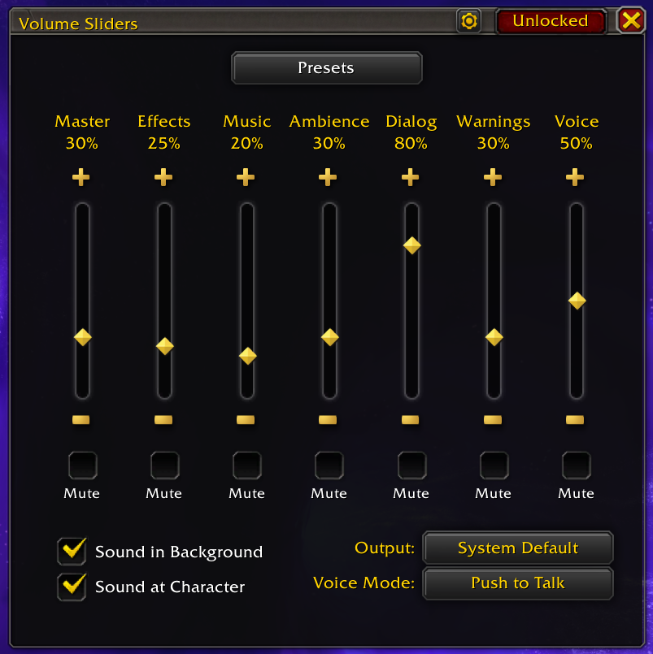

# Volume Sliders

Quick-access vertical volume sliders for every WoW sound channel, right from your minimap.


<p align="center">
  
</p>

## Installation

**CurseForge (recommended)**
[curseforge.com/wow/addons/volume-sliders](https://www.curseforge.com/wow/addons/volume-sliders)

**Manual**
1. Download or clone this repository.
2. Copy the inner `VolumeSliders/` folder into your WoW addons directory:
   ```
   World of Warcraft/_retail_/Interface/AddOns/
   ```
3. Restart WoW or type `/reload` in chat.

## Quick Reference

| Action | Result |
|--------|--------|
| **Left-click** minimap icon | Open / close the slider panel |
| **Right-click** minimap icon | Toggle master mute |
| **Scroll wheel** on minimap icon | Adjust volume for a mapped channel |
| **Hold left-click** (minimalist icon) | Push-to-Talk bypass (forces Open Mic) |
| **Ctrl + scroll** | Fine adjustment (1 % steps) |
| **▲ / ▼ arrows** on sliders | Snap to nearest 5 % |
| **Click outside** or **Escape** | Close the panel |

## Features

### Sliders & Sound Control
- **12 vertical volume sliders** covering Master, Effects, Music, Ambience, Dialog, Warnings, Gameplay, Pings, Voice Chat, Voice Ducking, Mic Volume, and Mic Sensitivity — each with per-channel mute toggles and stepper arrows that snap to the nearest 5 %.
- **Output device selector** with automatic per-device volume memory, plus a one-click Positional Audio toggle ("Sound at Character").

### Minimap Integration
- **Two icon styles** — classic ringed button or a minimalist speaker that auto-fades when idle.
- **Drag-and-drop tooltip builder** — choose which data rows appear on hover (volume levels, active presets, output device, etc.) and reorder them freely. Tooltips refresh live as you scroll or click.
- **Configurable scroll-wheel channels** with `Shift` / `Ctrl` / `Alt` modifier bindings for quick multi-channel control.

### Presets & Automation
- **Savable volume presets** with Absolute, Floor (minimum), and Ceiling (maximum) modes for granular control over how values are applied.
- **Manual toggle presets** — apply from the dropdown or minimap hotkey; press again to restore your original volumes. Presets support opt-in per-channel muting.
- **Context-aware automation** — zone-based presets activate on entry and revert on exit; LFG queue-pop and fishing-cast presets fire automatically and restore when the event ends.

### Window & Appearance
- **2D resizable window** — drag edges or corners; sliders and footer elements reflow automatically.
- **Custom backgrounds** — adjust window color and opacity via the native Blizzard color picker.
- **Lock, persist, or auto-close** — pin the window in place, keep it open across sessions, or let it dismiss on click-away.

### Ecosystem
- Fully integrated with the WoW 10.x+ **Addon Compartment** menu.
- **LibDataBroker** compatible — works with Titan Panel, ChocolateBar, ElvUI data texts, and similar display addons.

## Roadmap

Have an idea or want to see what's planned?
Browse the [open issues](https://github.com/SheldonMichaels/WoW-Volume-Sliders/issues) — feature requests and bug reports all live there.

## Libraries

This addon bundles the following libraries (included in `Libs/`):

- [LibStub](https://www.wowace.com/projects/libstub)
- [CallbackHandler-1.0](https://www.wowace.com/projects/callbackhandler)
- [LibDataBroker-1.1](https://www.wowace.com/projects/libdatabroker-1-1)
- [LibDBIcon-1.0](https://www.wowace.com/projects/libdbicon-1-0)

## License

All Rights Reserved © 2026 Sheldon Michaels — free for personal, non-commercial use. See [LICENSE](LICENSE) for details.
